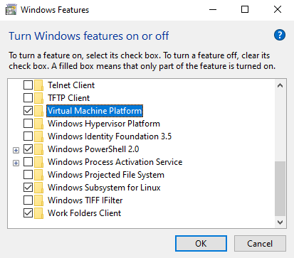

<style>
section {
  font-family: 'Century Gothic', serif !important;
  font-size: 26pt
}
</style>
<!-- _class: invert -->

# Windows Subsystem for Linux  <!-- fit -->
(known as WSL)

---
<!-- _class: invert -->

# What is the WSL and how it works ?

---

<!-- _class: invert -->

## What is the WSL ?

- Compatibility layer for running Linux binaries
- Linux compatible kernel interface
- Can interact directly with Windows
- Think for developers

---

<!-- _class: invert -->

 

# WSL is not a virtual machine !

---

<!-- _class: invert -->

## It's not as simple...

- It uses virtualization technologies but 
not works in a **partitioned environment**
- WSL can interact directly with your file systems
- Storages with assigned letter --> /mnt/X
- Different material resources management

---

<!-- _class: invert -->


# WSL 1 vs WSL 2
What's the difference ?

---

<!-- _class: invert -->

 

# WSL 1 architecture

---

<!-- _class: invert -->

 

# WSL 2 architecture

---

<!-- _class: invert -->


# The limits of the WSL

---

<!-- _class: invert -->

## Several limits

- Hardware acceleration not supported
- Audio not natively supported
- Network performances less efficient than 
a classic virtual machine

---

<!-- _class: invert -->


# Will WSLg the solution ?
To be continued...
<br>
https://github.com/microsoft/wslg

---

<!-- _class: invert -->


# How to install WSL

---

<!-- _class: invert -->

## Prerequisites

- Running Windows 10 64bits version 2004 or higher, or Windows 11 64bits
- Virtual Machine Platform feature

---

<!-- _class: invert -->

 

# Install WSL

or with Powershell

```Powershell
wsl --install
```
<br>
<br>
--> Reboot Windows

---

<!-- _class: invert -->


## WSL distributions available at this time

- Ubuntu
- Debian
- Kali Linux
- openSUSE
- Alpine Linux
- Fedora Remix
- Pengwin

---

<!-- _class: invert -->

 
# Pengwin Linux
https://github.com/WhitewaterFoundry/Pengwin


---

<!-- _class: invert -->


 

# Any questions ?

---

<!-- _class: invert -->


 

# Demo time !