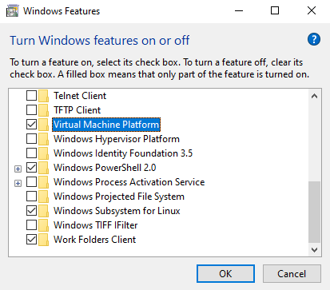

# Windows Subsystem for Linux (known as WSL)

*This article has been written to complete the presentation and to deal in depth with the subject in detail.*


__________

## What is the WSL and how it works ?

The WSL for **W**indows **S**ubsystem for **L**inux is a compatibility layer developed by Microsoft for running Linux binaries natively (ELF format) in a console environment on Windows 10 and Windows 11. This ingenious technology provides a Linux-compatible kernel interface and can interact directly with the Windows operating system with performances very close to a native Linux distribution. Moreover, it allows a user to choose a Linux distribution to install directly from the Microsoft Store (more info in below).

### WSL is not a virtual machine !

Oh my god, I have heard so many times *"WSL ? Yeah it's like a virtual machine on your Windows"* but no. It's not as simple...
Although WSL uses virtualization technologies in some cases (more information in the next section), it does not work in a partitioned environment on your Windows system like a classic virtual machine on VMware or VirtualBox.

It's important to know that all your storage devices that have an assigned letter by the Windows operating system (for example `C:`, `D:`, `E:`, ...) are reachable in the `/mnt` directory. As an example, the famous `C:` partition of your Windows system is in `/mnt/c` and this is same thing for the others.

> The NTFS and FAT partitions are directly mounted on the `/mnt` directory but it's necessary to execute some commands to mount EXT4 ones (more information below).

Therefore, the WSL can access to your storage devices and it may have some consequences. Indeed, if you try to delete your Document folder for example, you will notice that it will be permanently removed from your computer. You can also create a new file with a text editor like vim or nano and be able to edit it with a Windows text editor (like notepad for example).

> For the curious ones, we tried to do a `rm -fr /mnt/c` command with the WSL and the root privileges, to delete all the files in the **C:\\** directory. It seems that the WSL can only delete the files in the user folder in **C:\Users\<name_of-the_user>**. However, the windows system becomes quite unstable and slow.

### WSL 1 vs WSL 2

The first thing to know is that WSL 2 isn't only an simple evolution of the first version. The entire architecture has been redesigned and the operation is not the same.

First of all, let's see how the architecture of WSL 1 looks like :


As you can see, WSL 1 is a simple layer between the linux distribution and the Windows kernel. The Linux syscalls are converted into Windows syscalls with bridges.

Actually, we can compare the WSL 1 with the well known Wine software that permits to execute Windows applications on Linux systems by converting Windows API calls on Linux API calls.

However, we can notice in the architecture of the WSL 2 that there is a whole Linux kernel virtualized :


>The Virtual Machine Platform is a less powerful version of Hyper-V that still enables a hypervisor. Note that Microsoft if very vague on what the actual differences are between the Virtual Machine Platform and Hyper-V.

As we can see, the WSL 2 is based on a Linux kernel virtualized with the Windows Hypervisor Platform. This version has an increased I/O performance and a full system call compatibility. Indeed, initial versions of WSL 2 run up to 20 times faster compared to WSL 1 when unpacking a zipped tar archive, and around 2-5 times faster when using file intensive operations like git clone, apt upgrade, etc. Besides, unlike the WSL 1, it supports 32-bits applications.

However, if you are using files stored in storage devices on `/mnt` in your Windows file system, the WSL 1 will be faster than then second version. It has a lighter architecture and it does not need a hypervisor layer. But if you are using files stored in the root directory ( / ), WSL 2 will be even faster because file operations are moved on a VHD (Virtual Hardware Disk). You can access to this virtual disk with the windows explorer if you enter the command `explorer.exe` in your home directory or directly with the windows explorer by specifying the path `\\wsl$\<name_of_the_distro>`.

### The limits of WSL

First of all, hardware acceleration isn't supported so the graphic performances are quite poor and well known graphic standards, like the CUDA technology, are not implemented. Regarding the audio, it's not natively supported but it can be remedied by installing a network-capable sound server like PulseAudio.

> Currently, a better integrated desktop oriented WSL is still in development and its named WSLg. At this time, according to Microsoft, it only works on Windows 11 (build 22000+) or Windows 11 Insider Preview (builds 21362+). If you want more information, check the references section below.

Moreover, networking on WSL isn't fully reliable. WSL allows you to communicate with a network, but it may be less efficient because it needs to pass through a few layers in order to do work. This implies a considerable loss of performance when executing processes that operate at a low network level.

As Microsoft says in its documentation, WSL has been designed for the developers. So, if you want to host a Web service or sharing storages locally for example, it's better and more convenient to use a full Linux virtual machine in a classic hypervisor.

## Install WSL on Windows

### Requirements

First, you must be running Windows 10 64bits version 2004 or higher (Build 19041 or higher) or Windows 11 64bits.

>To check your Windows version and build number, select Windows logo key + R, type winver and select OK.

If you have an older version, update your system with Windows Update.

You need to have a Windows functionality installed before using WSL. To install it, select Windows Logo key, type **Windows Features** and enter. This window should open :



Make sure to install **Virtual Machine Platform**. After this, you must restart your Windows system.

Or you can type this command in a prompt with administrator privileges to install it :

```Powershell
dism.exe /online /enable-feature /featurename:VirtualMachinePlatform /all /norestart
```

Make sure to restart the system afterwards.

### Download WSL

You can install the WSL feature with the same procedure described before by selecting the **Windows Subsystem for Linux** or with the following Powershell command as an administrator :

```Powershell
wsl --install
```

>According to Microsoft, this command will activates the required optional components, downloads the latest Linux kernel, sets WSL 2 as default and installs a Linux distribution for you (Ubuntu by default)

or

```Powershell
dism.exe /online /enable-feature /featurename:Microsoft-Windows-Subsystem-Linux /all /norestart
```

> This command will only install WSL.
### WSL distributions available at this time

At this moment (when this article was written), you can install these distributions :

- Ubuntu
- Debian
- Kali Linux
- openSUSE
- Alpine Linux
- Pengwin (more information about it below)
- Fedora Remix

You can install the distribution you want directly on the Windows Store !

## Some useful WSL features

### Mount an ext file system on Windows (non-persistent)

First, you must be running Windows 11 Build 22000 or higher and have admin privileges. This procedure only works on the WSL 2.

``` Powershell
GET-CimInstance -query "SELECT * from Win32_DiskDrive"
```

This command should return a list of physical drives in this format :  

`\\.\PHYSICALDRIVEX` X : number of the physical drive

``` Powershell
wsl --mount DiskPath
```

### Add a desktop environment to your WSL

This procedure only works on the WSL 2.

## Appendix - Sources and References

You can find here all the references that we used to write this article and the presentation :

https://docs.microsoft.com/en-us/windows/wsl/about

https://www.whitewaterfoundry.com/what-is-wsl

https://docs.microsoft.com/en-us/windows/wsl/install

https://docs.microsoft.com/en-us/windows/wsl/compare-versions

https://docs.microsoft.com/en-us/virtualization/api/hypervisor-platform/hypervisor-platform

https://en.wikipedia.org/wiki/Windows_Subsystem_for_Linux

https://www.howtogeek.com/426749/how-to-access-your-linux-wsl-files-in-windows-10/

https://www.it-connect.fr/wsl-comment-acceder-aux-fichiers-linux-depuis-windows-10/

<br>

**Official GitHub repositories of the WSL project :**

WSL 1 (only for issue reporting) : https://github.com/microsoft/WSL

WSL 2 : https://github.com/microsoft/WSL2-Linux-Kernel

WSLg : https://github.com/microsoft/wslg

<br>

**Lists of different compatibles softwares that work or not on WSL :**

https://github.com/ethanhs/WSL-Programs

https://github.com/davatron5000/can-i-subsystem-it
__________

*Updated : 18/02/2022, Authors : Xen0rInspire, AnthonyF*
