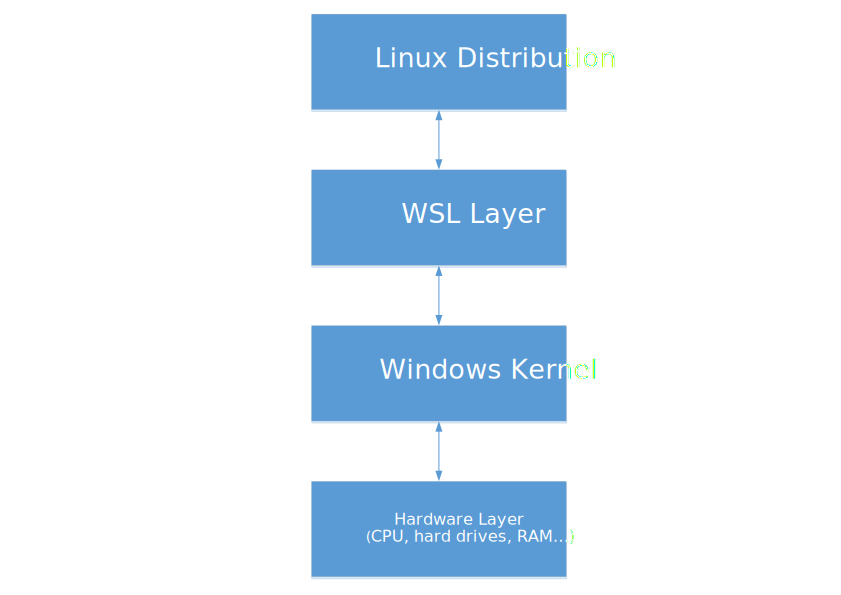

# Windows Subsystem for Linux (known as WSL)

*This article has been written to complete the presentation and to deal in depth with the subject in detail.*


__________

## What is the WSL and how it works?

The WSL for **W**indows **S**ubsystem for **L**inux is a compatibility layer developed by Microsoft for running Linux binaries natively (ELF format) in a console environment on Windows 10 and Windows 11. This ingenious technology provides a Linux-compatible kernel interface and can interact directly with the windows operating system with performances very close to a native Linux distribution. Moreover, it allows a user to chose a Linux distribution to install from the Microsoft Store (more info in below).

### WSL is not a virtual machine !

Oh my god, I have heard so many times *"WSL ? Yeah it's like a virtual machine on your Windows"* but no. It's not as simple...
Although WSl uses virtualization technologies in some cases (more information in the next section), it does not work in a partitioned environment on your Windows system like a classic virtual machine on VMWare or Virtualbox.

It's important to know that all your storage devices that have an assigned letter by the Windows operating system (for example C:, D:, E: ...) are reachable in the `/mnt` directory. As an example, the famous `C:` partition of your Windows system is in `/mnt/c` and this is same thing for the others.

> The NTFS and FAT partitions are directly mounted in the `/mnt` directory but it's necessary to execute some commands to mount EXT4 ones.

Therefore, the WSL can access to your storage devices and it may have some consequences. Indeed, if you try to delete your Document folder for example, you will notice that it will be permanently removed from your computer. You can also create a new file with a text editor like vim or nano, and you will be able to edit it with a Windows text editor (like notepad.

> For the curious ones, we tried to do a `rm -fr /mnt/c` command with the WSL and the root privileges, to delete all the files in the **C:\\** directory. It seems that the WSL can only delete the files in the user folder in **C:\Users\<name_of-the_user>**. However, the windows system becomes quite unstable and slow.

### WSL 1 vs WSL 2

The first thing to know is that WSL 2 isn't only an simple evolution of the first version. The entire architecture has been redesigned and the operation is not the same.

First of all, let's see how the architecture of WSL 1 looks like :



As you can see, WSL 1 is a simple layer between the linux distribution and the Windows kernel. The Linux syscalls are converted into Windows syscalls with bridges.

Actually, we can compare the WSL 1 with the well known Wine software that permits to execute Windows applications on Linux systems by converting Windows API calls on Linux API calls.

However, we can notice in the architecture of the WSL 2 that there is a whole Linux kernel virtualized :


>The Hypervisor platform is not Hyper-V ! It's an API that third-party developers can use for Hyper-V, VMWare Workstation/Player, Virtualbox... It adds an extended user-mode API for third-party virtualization stacks and applications to create and manage partitions at the hypervisor level, configure memory mappings for the partition, and create and control the execution of virtual processors.

As we can see, the WSL 2 is based on a Linux kernel virtualized with the Windows Hypervisor Platform. This version has an increased I/O performance and a full system call compatibility. Indeed, initial versions of WSL 2 run up to 20 times faster compared to WSL 1 when unpacking a zipped tar archive, and around 2-5 times faster when using file intensive operations like git clone, apt uppragde, etc...

However, if you are using files stored in storage devices on `/mnt` in your Windows file system, the WSL 1 will be faster than then second version. It has a lighter architecture and it does not need a hypervisor layer.

But if you are using files stored in the root directory ( / ), WSL 2 will be even faster because file operations are moved on a VHD (Virtual Hardware Disk). You can access to this virtual disk with the windows explorer if you enter the command `explorer.exe` in your home directory.

### The limits of WSL

## Install WSL on Windows

### Requirements

First, you must be running Windows 10 version 2004 or higher (Build 19041 or higher) or Windows 11.

>To check your Windows version and build number, select Windows logo key + R, type winver and select OK.

### Download WSL

### WSL distributions available at this time

## Some useful WSL features

### Mount an ext file system on Windows (with WSL2 only) (non-persistent)

First you must be running Windows 11 Build 22000 or higher and have admin privileges.


``` Powershell
GET-CimInstance -query "SELECT * from Win32_DiskDrive"
```

The command should return a list of physical drives in this format :  

`\\.\PHYSICALDRIVEX` X : number of the physical drive

``` Powershell
wsl --mount DiskPath
```

### Add a desktop environment to your WSL

### Use Docker on Windows (with WSL2 only)

## Pengwin Linux

## Appendix - Sources and References

You can find here all the references that we used to write this article and the presentation :

https://docs.microsoft.com/en-us/windows/wsl/about

https://www.whitewaterfoundry.com/what-is-wsl

https://docs.microsoft.com/en-us/windows/wsl/install

https://docs.microsoft.com/en-us/windows/wsl/compare-versions

https://docs.microsoft.com/en-us/virtualization/api/hypervisor-platform/hypervisor-platform

https://www.howtogeek.com/426749/how-to-access-your-linux-wsl-files-in-windows-10/

<br>

**Official GitHub repositories of the WSL project :**

WSL 1 (only for issue reporting) : https://github.com/microsoft/WSL

WSL 2 : https://github.com/microsoft/WSL2-Linux-Kernel

<br>

**Lists of different compatibles softwares that work on WSL :**

https://github.com/ethanhs/WSL-Programs

https://github.com/davatron5000/can-i-subsystem-it
__________

*Updated : 14/02/2022, Authors : Xen0rInspire, AnthonyF*
